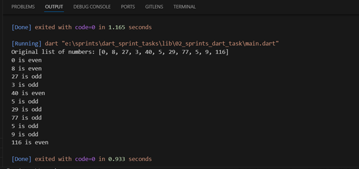

# 🔢 Number Categorizer


A simple and efficient Dart program that categorizes a list of numbers into even and odd using for loop and switch case.

## 📝 Description

This program demonstrates how to categorize numbers into even and odd categories using Dart programming language. It utilizes a for loop for iteration and a switch case for categorization, making it a perfect example for understanding basic control structures in Dart.

## 💻 Code 

```dart
void main() {
  List<int> numbers = [0, 8, 27, 3, 40, 5, 29, 77, 5, 9, 116];

  print('Original list of numbers: $numbers');

  for (int i = 0; i < numbers.length; i++) {
    switch (numbers[i] % 2) {
      case 0:
        print('${numbers[i]} is even');
        break;
      case 1:
        print('${numbers[i]} is odd');
        break;
      default:
        print('${numbers[i]} is invalid');
    }
  }
}
```
## 📋 Sample Output

 